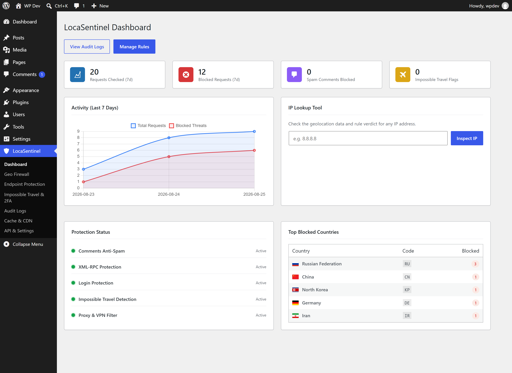
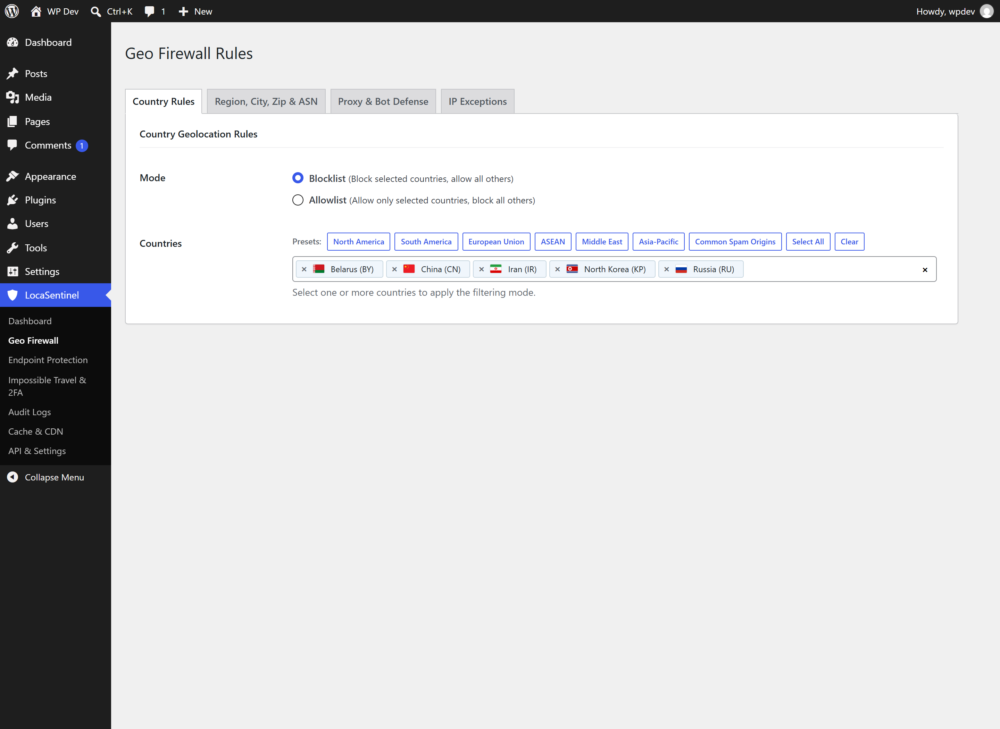
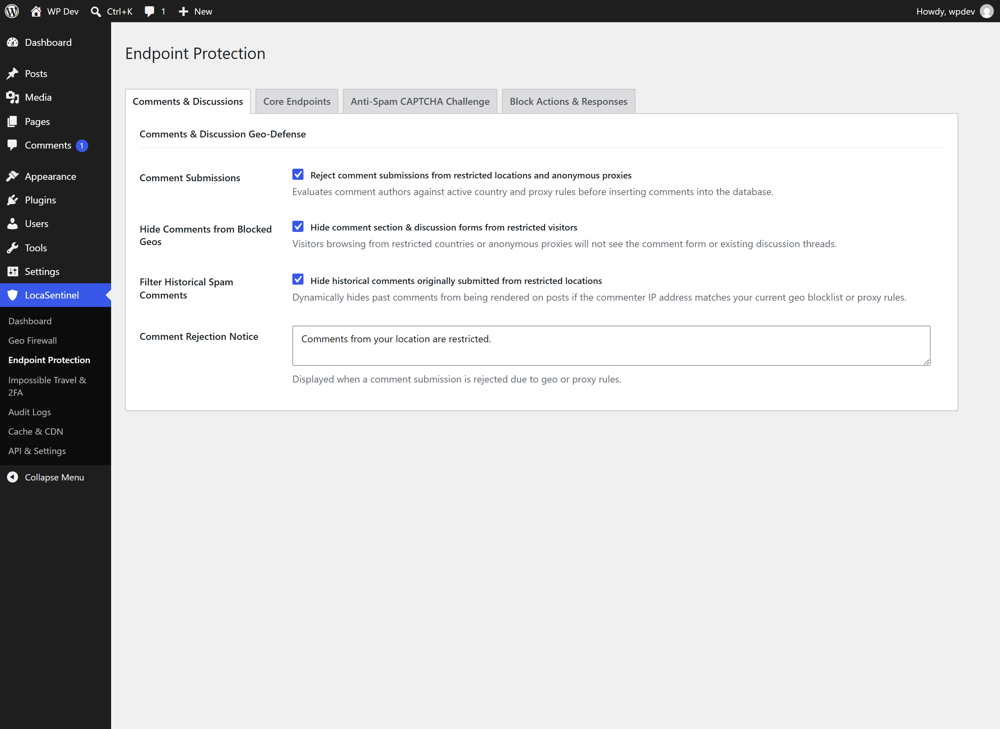
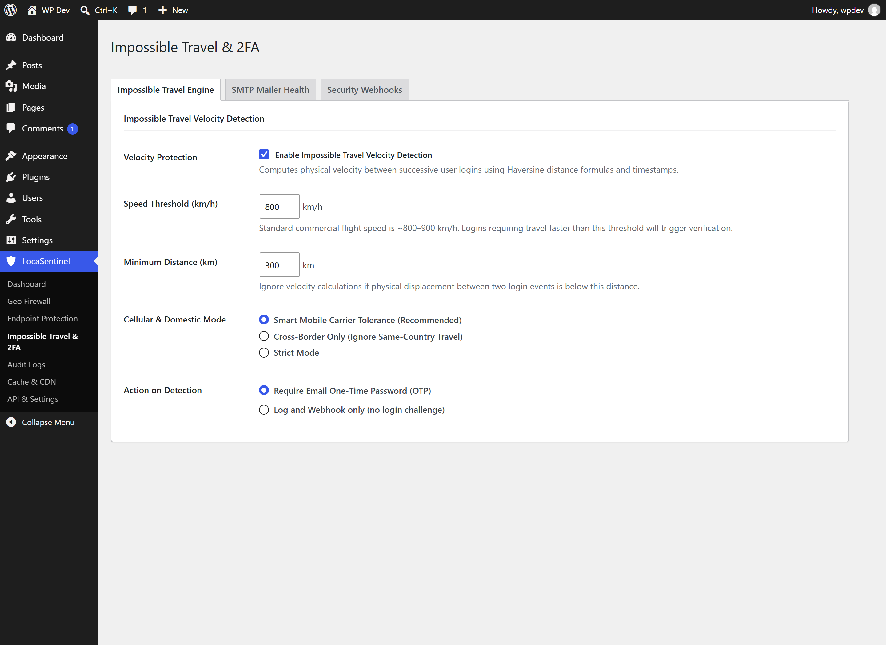
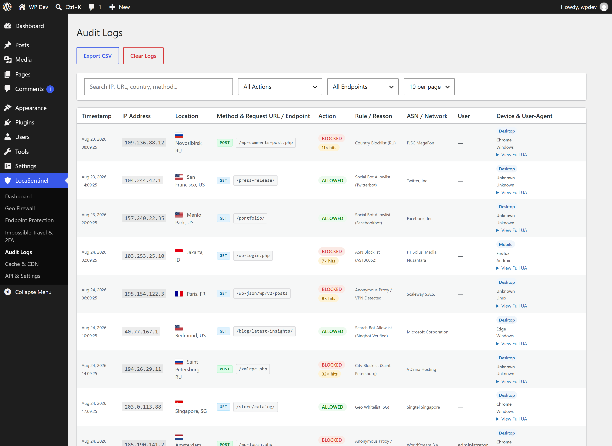
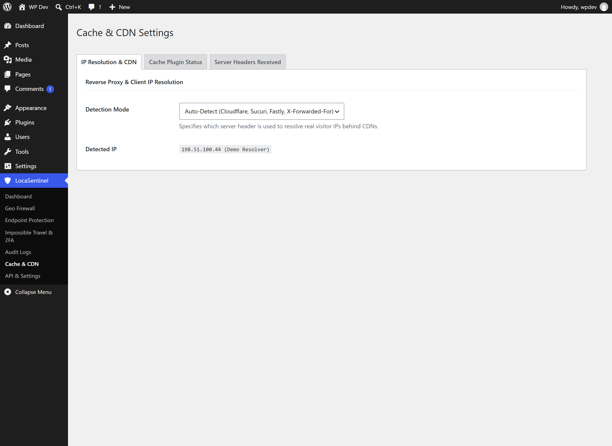
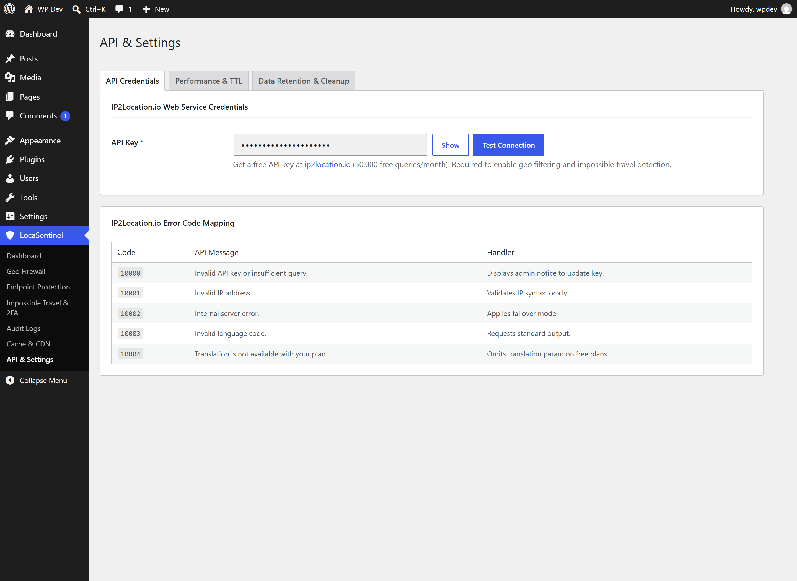
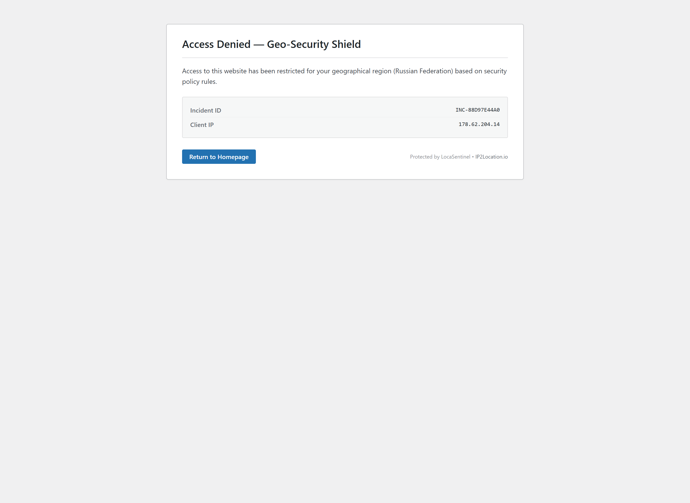
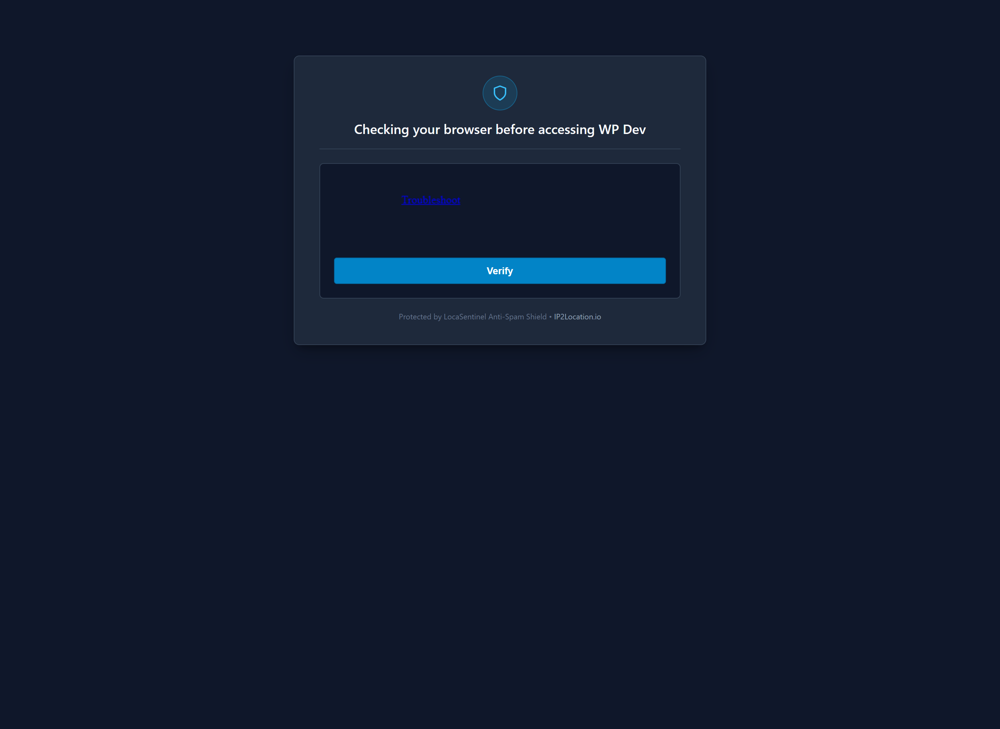

# LocaSentinel

> **Geo-Security, Impossible Travel 2FA, Comment Spam Defense & Reverse Proxy Firewall for IP2Location**  
> Built for the **IP2Location Programming Contest 2026** using the **IP2Location.io Free API** by **Mardhiah Air Network**.

---

# Disclaimer
> - The project is a demo/contest implementation.
> - It is not a replacement for a WAF, DDoS protection, or full MFA.
> - Geolocation depends on IP2Location data/API availability.
> - CAPTCHA clearance is tied to the client IP.
> - Changing IP addresses can require a new CAPTCHA challenge.
> - Trusted proxy/CDN configuration affects IP detection.
> - Fail-open and fail-safe modes have different security implications.
> - Impossible Travel is an additional authentication signal.

---

## 🏆 IP2Location Programming Contest 2026

**LocaSentinel** was created specifically for the **IP2Location Programming Contest 2026**. It is designed to leverage the **IP2Location.io Free API** (supporting free tier keys with 50,000 monthly lookups), featuring:
* **High-Performance In-Memory & Transient Caching**: Maximizes free tier API efficiency by caching IP geolocation lookups in memory (Redis auto-driver) and WordPress transients with configurable TTL (default 24 hours), reducing unnecessary API roundtrips by up to 99%.
* **Zero-Failure Fallback**: In the event of API timeouts or rate limits, LocaSentinel gracefully fails open or safe according to your configured policy, ensuring zero disruption to legitimate visitors.

---

## Key Capabilities

### 1. Geo Firewall & Access Control
* **Country Filtering**: Blocklist or Allowlist modes with quick regional presets (North America, South America, European Union, ASEAN, Middle East & GCC, Asia-Pacific, Common Spam Origins).
* **Granular Rule Sets**: Filter traffic by state/region name, city, postal/ZIP code, and ASN / ISP organization name.
* **Proxy & VPN Detection**: Identify and block anonymous proxies, VPNs, TOR nodes, and hosting data center ranges (`is_proxy == true`).
* **Extended Crawler & Bot Allowlist**:
  * **Search Engines**: Googlebot, Bingbot, Yahoo! Slurp, Baiduspider, YandexBot, DuckDuckBot, Applebot, Naver Yeti, Sogou, Seznam.
  * **Anti-Spoofing Verification (rDNS)**: Performs reverse DNS lookups on search bot requests to verify genuine crawler identity.
  * **Social Media Previewers**: Facebook / Meta, Twitter / X, LinkedIn, Pinterest, WhatsApp, Telegram, Discord, Slack.
  * **SEO & Monitoring**: AhrefsBot, SemrushBot, Moz, UptimeRobot, Pingdom, Screaming Frog.
  * **AI & LLM Crawlers**: GPTBot, ChatGPT-User, ClaudeBot, Anthropic-AI, PerplexityBot, Google-Extended, Bytespider, CCBot.
  * **Custom User-Agent Patterns**: Whitelist proprietary crawlers, monitoring tools, or webhook scrapers with custom substring or regular expression rules.
* **IP Exceptions**: IPv4 and IPv6 allowlist and blocklist supporting single IPs, wildcards (`*`), and CIDR subnet notation (`192.168.1.0/24`).

### 2. Impossible Travel Velocity Detection & 2FA
* **Velocity Calculation**: Computes geographical displacement and travel speed between consecutive logins using the Haversine great-circle formula:
  $$\Delta \sigma = 2 \arcsin \sqrt{\sin^2\left(\frac{\Delta \phi}{2}\right) + \cos \phi_1 \cos \phi_2 \sin^2\left(\frac{\Delta \lambda}{2}\right)}$$
  $$\text{Velocity} = \frac{R \cdot \Delta \sigma}{\Delta t}$$
* **Email OTP Verification**: Suspicious logins exceeding the configured speed threshold (default 800 km/h) are challenged with a 6-digit one-time password valid for 10 minutes.
* **Dynamic Mobile Carrier Tolerance**: Cellular networks dynamically rotate IPs through regional gateways. LocaSentinel tracks device signatures and carrier ASN data to prevent false-positive lockouts on domestic mobile traffic.
* **SMTP Safety Safeguard**: Detects active SMTP plugins (WP Mail SMTP, Post SMTP, FluentSMTP, Easy WP SMTP) and automatically mutes OTP challenges when SMTP is unconfigured to prevent admin lockouts.
* **Security Webhooks with `{{variable}}` Templating**: Dispatches instant alerts to Discord, Slack, Telegram, or custom endpoints with full placeholder interpolation (`{{ip}}`, `{{country_name}}`, `{{user_login}}`, `{{speed_kmh}}`, `{{timestamp}}`) in both custom JSON payloads and dynamic URL parameters.

### 3. Endpoint Hardening & Discussion Protection
* **Multi-Layer Comment & Geo Defense**:
  * **Submission Rejection**: Intercepts spam submissions at the WordPress hook level (`preprocess_comment`) before database insertion, rejecting comments originating from blocked countries or anonymous proxies.
  * **Visitor Comment Hiding**: Dynamically hides the comment section, discussion form, and comment count for visitors browsing from restricted territories or proxies.
  * **Historical Comment Filter**: Automatically filters past comments previously submitted by blocked IP addresses or countries from being displayed on posts.
* **XML-RPC Protection**: Blocks unauthorized XML-RPC requests and pingbacks commonly exploited in brute-force amplification attacks.
* **Login Protection**: Restricts access to `wp-login.php` to authorized geographical territories.
* **REST API Protection with Admin Bypass**: Intercepts unauthenticated REST routes for restricted territories while granting priority-99 bypass for authenticated administrators and editors.

### 4. Anti-Spam Whole-Website Rate Limiting & CAPTCHA Challenge
* **Persistent 24-Hour Enforcement**: Monitors request frequency per URL path. When an IP spams the same link excessively (e.g. >10 requests in 60 seconds), the IP is locked into a challenge state in the database for 24 hours. Waiting or refreshing does not bypass the challenge.
* **Whole-Website Clearance**: Legitimate visitors who successfully solve the challenge receive 24-hour clearance across the entire website.
* **Strict Geo-Restriction Enforcement**: Even after solving the CAPTCHA, if a visitor's origin IP resides in a restricted country or blacklisted network, the Geo Firewall strictly maintains access denial (HTTP 403).
* **Non-Restricted Geo Spam Defense**: Administrators can toggle whether allowed/whitelisted country traffic is subjected to the anti-spam CAPTCHA challenge when spam thresholds are exceeded.
* **Supported Providers**: Cloudflare Turnstile, hCaptcha, Google reCAPTCHA v2 (Checkbox), and Google reCAPTCHA v3 (Invisible).

### 5. Cache & CDN Interoperability
* **Redis In-Memory Auto-Driver**: Automatically detects and connects to Redis for in-memory geolocation caching, fast log debouncing, and rate limiting when Redis is available.
* **Cache Vary Headers**: Sends `DONOTCACHEPAGE` and `X-LiteSpeed-Vary` headers on blocked responses so page caching plugins never store or serve blocked content to legitimate users.
* **Supported Cache Engines**: Redis, LiteSpeed Cache, WP Rocket, W3 Total Cache, WP Super Cache, WP Fastest Cache, SG Optimizer.
* **Reverse Proxy IP Resolution**: Accurate client IP extraction across Cloudflare (`CF-Connecting-IP`), Sucuri (`X-Sucuri-ClientIP`), Fastly, Akamai, AWS CloudFront, and Nginx reverse proxies.

### 6. Security Audit Logging & Analytics
* **Anti-Spam Log Debouncing**: Aggregates repeated identical blocked hits within a 5-minute window into a single row with an incremental hit counter (`hit_count`), preventing database bloat from automated spam or bot probes.
* **Noise Filtering**: Automatically ignores favicons, app icons, web manifests, crawler definitions (`robots.txt`, `sitemaps`), and common static assets from the audit log table.
* **Granular Event Telemetry**: Indexed `{wpdb_prefix}_ip2location_logs` recording timestamp, client IP, country, city, ASN, HTTP Method (`GET`, `POST`, `PUT`, `DELETE`), Request URL, target endpoint, action verdict, username, device type, browser, OS, and full user-agent.
* **Export & Maintenance**: Instant CSV export and automated daily retention cleanup cron.

---

## Technical Architecture

```
ip2location-sentinel/
├── ip2location-sentinel.php    # Plugin bootstrap, constants & PSR-4 autoloader
├── readme.txt                  # WordPress plugin repository documentation
├── README.md                   # Repository & developer overview
├── assets/
│   └── flags/                  # 271 local SVG country flags (Lipis Flag Icons, MIT)
├── src/                        # PSR-4 Namespace (IP2Location\Sentinel\)
│   ├── Activator.php           # Activation routines, table migration & options setup
│   ├── Admin.php               # Native admin tabs, AJAX live filtering & autosave engine
│   ├── ApiClient.php           # IP2Location.io Free API client, transient cache & error handling
│   ├── CacheCompat.php         # Cache headers (LiteSpeed Vary, WP Rocket, DONOTCACHEPAGE)
│   ├── Captcha.php             # Cloudflare Turnstile, hCaptcha & Google reCAPTCHA engine
│   ├── Countries.php           # ISO-3166-1 country data, local SVG flag helpers & regional presets
│   ├── Deactivator.php         # Deactivation hooks & cron cleanup
│   ├── Firewall.php            # Request lifecycle hooks, admin bypass & block dispatch
│   ├── ImpossibleTravel.php    # Haversine velocity engine, mobile tolerance & 2FA OTP
│   ├── IpResolver.php          # Reverse proxy header resolution & localhost fallback
│   ├── Logger.php              # Database audit logger, anti-spam debouncer & CSV exporter
│   ├── RedisDriver.php         # Redis auto-detection & high-performance memory storage
│   ├── RuleEngine.php          # Core rule evaluation engine (countries, ASN, proxies, IPs)
│   ├── SmtpChecker.php         # SMTP mailer plugin detection & email delivery safety
│   ├── UserAgent.php           # Zero-dependency MobileDetect parser (Device, Browser, OS, Bots)
│   └── Webhook.php             # Multi-platform webhook dispatcher (Discord, Slack, Telegram)
├── admin/
│   ├── css/
│   │   └── ip2loc-admin.css    # Responsive native WordPress admin styling
│   ├── js/
│   │   └── ip2loc-admin.js     # Real-time AJAX live filter, Select2 & debounced autosave
│   └── views/
│       ├── audit-logs.php      # Live AJAX audit log viewer with HTTP method badges
│       ├── block-template.php  # Public 403 geo-blocked template
│       ├── captcha-challenge-template.php # Public 429 Anti-Spam CAPTCHA challenge template
│       ├── dashboard.php       # Overview KPI metrics, traffic chart & IP inspector
│       ├── settings-api.php    # Free API configuration & live connection test
│       ├── settings-cache-cdn.php # Cache engine status & header diagnostics
│       ├── settings-impossible-travel.php # Impossible travel, 2FA & webhook settings
│       ├── settings-protection.php # Endpoint hardening, CAPTCHA & block templates
│       └── settings-rules.php  # Geo Firewall rule manager & regional presets
```

---

## Screenshots

| 1. Dashboard Overview & Traffic Analytics | 2. Geo Firewall Rules & Regional Presets |
| :---: | :---: |
|  |  |
| **3. Endpoint Protection & Anti-Spam** | **4. Impossible Travel Velocity & 2FA** |
|  |  |
| **5. Real-Time Security Audit Logs** | **6. Cache & CDN Diagnostic Inspector** |
|  |  |
| **7. Public 403 Forbidden Shield Template** | **8. Public 429 Anti-Spam CAPTCHA Shield** |
|  |  |
| **9. API Configuration & Connection Test** | |
|  | |

---

## Installation & Setup

1. Copy or clone `ip2location-sentinel` into `/wp-content/plugins/`.
2. Activate the plugin in **WordPress Admin > Plugins**.
3. Go to **LocaSentinel > API & Settings** and enter your free API key from [ip2location.io](https://www.ip2location.io).
4. Click **Test Connection** to verify API connectivity.
5. Configure your access rules in **Geo Firewall** and **Endpoint Protection**.

---

## Credits & Third-Party Assets

* **IP Geolocation & Threat Intelligence**: Powered by [IP2Location.io](https://www.ip2location.io) (IP2Location Programming Contest 2026).
* **Country Flag SVG Assets**: 271 self-hosted local vector SVG flags sourced from [Flag Icons by Lipis](https://github.com/lipis/flag-icons) (Panayiotis Lipiridis), licensed under the [MIT License](https://opensource.org/licenses/MIT).

---

## Author & License

* **Plugin Name**: LocaSentinel
* **Contest**: IP2Location Programming Contest 2026
* **API Version**: IP2Location.io Free API Tier (50,000 queries/month)
* **Author**: Mardhiah Air Network (`mardhiahnetwork@gmail.com`)
* **License**: GNU General Public License v2.0 or later (GPLv2+)


